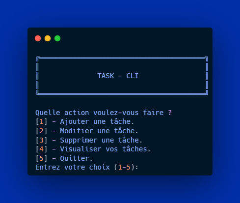

# Task-CLI 



Petit utilitaire CLI pour gérer des tâches depuis la ligne de commande.

## Prérequis

- Java 21 (ou supérieur compatible avec le `maven.compiler.release` du projet)
- Maven 3.x

## Compilation

Construire le paquet (tests optionnels) :

```bash
mvn -DskipTests clean package
```

Le build produit l'artefact dans `target/` (ex. `TaskManager-1.0-SNAPSHOT.jar` ou `-shaded.jar`).

## Exécution

Lancer l'application :

```bash
java -jar target/TaskManager-1.0-SNAPSHOT.jar
```

L'application est interactive : utilisez le clavier pour entrer les choix et appuyez sur Entrée.
Si vous exécutez depuis un script non interactif, fournissez des entrées via un pipe, par exemple :

```bash
printf "1\n" | java -jar target/TaskManager-1.0-SNAPSHOT.jar
```